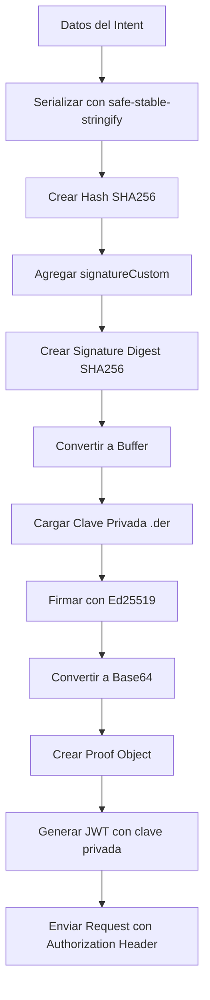

# Guía de Implementación de Autenticación Minka

Esta guía explica paso a paso cómo implementar la autenticación completa para la API de Minka, incluyendo la generación de hashes, firmas digitales, y JWT tokens.

## Tabla de Contenidos

1. [Configuración Inicial](#configuración-inicial)
2. [Generación de Archivo .der desde PEM](#generación-de-archivo-der-desde-pem)
3. [Creación del Hash](#creación-del-hash)
4. [Generación del Signature Digest](#generación-del-signature-digest)
5. [Creación del Digest Buffer](#creación-del-digest-buffer)
6. [Generación de la Firma Base64](#generación-de-la-firma-base64)
7. [Mapeo a Campos del Proof](#mapeo-a-campos-del-proof)
8. [Generación de JWT](#generación-de-jwt)
9. [Ejemplo Completo](#ejemplo-completo)

## Configuración Inicial

### 1. Instalación de Dependencias

```bash
npm install crypto dayjs fs path util
npm install @minka/ledger-sdk
npm install jose @noble/ed25519 base64url safe-stable-stringify
```

### 2. Configuración de Claves

```typescript
// Configuración de claves Ed25519 en formato raw (base64)
const SIGNER = "your-signer-name";
const PUBLIC_KEY = "dGVzdF9wdWJsaWNfa2V5X2Jhc2U2NF9zdHJpbmc="; // Example key
const SECRET_KEY = "dGVzdF9wcml2YXRlX2tleV9iYXNlNjRfc3RyaW5n"; // Example key

const keyPair = {
  format: "ed25519-raw" as const,
  public: PUBLIC_KEY,
  secret: SECRET_KEY,
};
```

## Generación de Archivo .der desde PEM

### Usando Minka Signer Export Command

```bash
# Exportar clave privada desde PEM a DER
minka signer export --input private-key.pem --output your-key.der --format der
```

### Conversión Manual (si no tienes minka signer)

```typescript
import { privateKeyEd25519RawToDer } from "./asn1";
import crypto from "crypto";

// Convertir clave raw a DER
function createDerFromRawKey(rawKeyBase64: string): Buffer {
  const rawKeyHex = Buffer.from(rawKeyBase64, "base64").toString("hex");
  const derKeyHex = privateKeyEd25519RawToDer(rawKeyHex);
  return Buffer.from(derKeyHex, "hex");
}

// Guardar archivo .der
const derBuffer = createDerFromRawKey(SECRET_KEY);
fs.writeFileSync("your-key.der", derBuffer);
```

## Creación del Hash

### 1. Función de Serialización

```typescript
import stringify from "safe-stable-stringify";
import crypto from "crypto";

function serializeData(data: any): string {
  const result = stringify(data);
  if (result === undefined) {
    throw new Error("serializeData: failed to stringify input");
  }
  return result;
}
```

### 2. Función de Hash

```typescript
const HASHING_ALGORITHM = "sha256";

function createHash(data: any): string {
  const serialized = serializeData(data);
  return crypto.createHash(HASHING_ALGORITHM).update(serialized).digest("hex");
}
```

### 3. Uso del Hash

```typescript
// Datos del intent
const data = {
  handle: "20250903795828547TFY595495513812965",
  claims: [claim],
  schema: "payment",
  access: getOwnerAccessRules(PUBLIC_KEY),
  config: {
    commit: "auto",
  },
};

// Generar hash
const hash = createHash(data);
console.log("HASH:", hash);
```

## Generación del Signature Digest

### 1. Función de Signature Digest

```typescript
function createSignatureDigest(
  dataHash: string,
  signatureCustom?: Record<string, any>
): string {
  const serializedCustom = signatureCustom
    ? serializeData(signatureCustom)
    : "";
  return crypto
    .createHash(HASHING_ALGORITHM)
    .update(dataHash + serializedCustom)
    .digest("hex");
}
```

### 2. Uso del Signature Digest

```typescript
// Datos personalizados para la firma
const signatureCustom = {
  moment: "2025-09-04T10:10:31.616Z",
  status: "created",
};

// Generar signature digest
const signatureDigest = createSignatureDigest(hash, signatureCustom);
console.log("SIGNATURE DIGEST:", signatureDigest);
```

## Creación del Digest Buffer

```typescript
// Convertir hex string a Buffer
const digestBuffer = Buffer.from(signatureDigest, "hex");
console.log("DIGEST BUFFER:", digestBuffer);
```

## Generación de la Firma Base64

### 1. Cargar Clave Privada

```typescript
function getPrivateKey(): crypto.KeyObject {
  const keyDer = fs.readFileSync(path.resolve(__dirname, "../your-key.der"));
  return crypto.createPrivateKey({
    key: keyDer,
    format: "der",
    type: "pkcs8",
  });
}
```

### 2. Firmar el Digest

```typescript
// Obtener clave privada
const privateKey = getPrivateKey();

// Firmar el digest
const signatureBase64 = crypto
  .sign(undefined, digestBuffer, privateKey)
  .toString("base64");

console.log("SIGNATURE BASE64:", signatureBase64);
```

## Mapeo a Campos del Proof

### Estructura del Proof

```typescript
const proof = {
  method: "ed25519-v2", // Algoritmo de firma
  custom: signatureCustom, // Datos personalizados de la firma
  digest: signatureDigest, // Digest de la firma (hex)
  public: keyPair.public, // Clave pública (base64)
  result: signatureBase64, // Firma resultante (base64)
};
```

### Mapeo Completo en la Request

```typescript
const request = {
  data, // Datos del intent
  hash, // Hash de los datos
  meta: {
    proofs: [proof], // Array de pruebas de firma
  },
};
```

## Generación de JWT

### 1. Función de Firma JWT

```typescript
import { signJWT } from "./jwt-auth";

async function generateJWT(
  signer: string,
  ledger: string,
  secretKey: string,
  publicKey: string
): Promise<string> {
  const payload = {
    iss: signer, // Emisor
    sub: `signer:${signer}`, // Sujeto
    aud: ledger, // Audiencia
    iat: Math.floor(Date.now() / 1000), // Emitido en
    exp: Math.floor(Date.now() / 1000) + 3600, // Expira en (1 hora)
  };

  return await signJWT(payload, secretKey, publicKey);
}
```

### 2. Uso del JWT

```typescript
// Generar JWT
const jwt = await generateJWT(SIGNER, LEDGER, SECRET_KEY, PUBLIC_KEY);
console.log("JWT:", jwt);

// Usar en headers de la request
const headers = {
  "Content-Type": "application/json",
  "x-ledger": LEDGER,
  Authorization: `Bearer ${jwt}`,
};
```

## Ejemplo Completo

### Archivo: `intents-api.ts`

```typescript
import axios from "axios";
import crypto from "crypto";
import dayjs from "dayjs";
import fs from "fs";
import path from "path";
import util from "util";
import { createHash, createSignatureDigest } from "./hash";
import { signJWT } from "./jwt-auth";

// Configuración
const LEDGER = "ledger-name";
const SERVER = "https://ldg-stg.one/api/v2";

// Datos del intent
const claim = {
  action: "transfer",
  source: {
    handle: "svgs:234234234@bancoamarillo.com.co",
    custom: {
      documentNumber: "123456789",
      documentType: "txid",
      entityType: "business",
      name: "Mi Negocio",
    },
  },
  target: {
    // información del target recibida en la resolución del alias
    handle: "svgs:1234567@bancorojo.co",
    custom: {
      firstName: "NOMBRE",
      lastName: "APELLIDO",
      aliasType: "tel",
      documentType: "cc",
      documentNumber: "1022353257",
      routingCode: "TFY",
      participantCode: "890981912",
      accountRef: "wTYNG1uWRG2NrL6y9SdTnxfCSCf4F87XkQ",
    },
  },
  symbol: { handle: "cop" },
  amount: 400,
};

const data = {
  handle: "20250903795828547TFY595495513812965",
  claims: [claim],
  schema: "payment",
  access: getOwnerAccessRules(PUBLIC_KEY),
  config: {
    commit: "auto",
  },
};

// Datos personalizados para la firma
const signatureCustom = {
  moment: "2025-09-04T10:10:31.616Z",
  status: "created",
};

// Función principal
export const createIntentWithApi = async () => {
  try {
    // 1. Crear hash de los datos
    const hash = createHash(data);
    console.log("HASH:", hash);

    // 2. Crear signature digest
    const signatureDigest = createSignatureDigest(hash, signatureCustom);
    console.log("SIGNATURE DIGEST:", signatureDigest);

    // 3. Convertir a buffer
    const digestBuffer = Buffer.from(signatureDigest, "hex");

    // 4. Cargar clave privada
    const privateKey = getPrivateKey();

    // 5. Firmar y obtener base64
    const signatureBase64 = crypto
      .sign(undefined, digestBuffer, privateKey)
      .toString("base64");
    console.log("SIGNATURE BASE64:", signatureBase64);

    // 6. Crear proof
    const proof = {
      method: "ed25519-v2",
      custom: signatureCustom,
      digest: signatureDigest,
      public: PUBLIC_KEY,
      result: signatureBase64,
    };

    // 7. Crear request
    const request = {
      data,
      hash,
      meta: {
        proofs: [proof],
      },
    };

    // 8. Generar JWT
    const jwt = await signJWT(
      {
        iss: SIGNER,
        sub: `signer:${SIGNER}`,
        aud: LEDGER,
        iat: Math.floor(Date.now() / 1000),
        exp: Math.floor(Date.now() / 1000) + 3600,
      },
      SECRET_KEY,
      PUBLIC_KEY
    );
    console.log("JWT:", jwt);

    // 9. Enviar request
    const response = await axios.post(`${SERVER}/intents`, request, {
      headers: {
        "Content-Type": "application/json",
        "x-ledger": LEDGER,
        Authorization: `Bearer ${jwt}`,
      },
    });

    console.log("RESPONSE:", response.data);
  } catch (error: any) {
    console.error("ERROR:", error.response?.data || error.message);
  }
};

// Función auxiliar para cargar clave privada
function getPrivateKey() {
  const keyDer = fs.readFileSync(path.resolve(__dirname, "../htorohn-key.der"));
  return crypto.createPrivateKey({
    key: keyDer,
    format: "der",
    type: "pkcs8",
  });
}

// Función auxiliar para reglas de acceso
function getOwnerAccessRules(publicKey: string) {
  return [
    {
      action: "any",
      signer: {
        public: publicKey,
      },
    },
  ];
}
```

## Flujo de Autenticación Completo



## Consideraciones Importantes

1. **Seguridad**: Nunca hardcodees las claves privadas en el código de producción
2. **Formato de Claves**: Las claves deben estar en formato Ed25519 raw (base64)
3. **Serialización**: Usa `safe-stable-stringify` para garantizar consistencia
4. **Timestamps**: Los timestamps deben estar en formato ISO 8601
5. **Validación**: Siempre valida los datos antes de firmar
6. **Manejo de Errores**: Implementa manejo robusto de errores en cada paso

## Troubleshooting

### Error: "Unexpected raw private key length"

- Verifica que la clave privada tenga exactamente 64 caracteres en hex (32 bytes)

### Error: "Invalid pkcs5 encrypted key format"

- Asegúrate de que el archivo .der esté en formato PKCS#8 correcto

### Error: "JWT signing failed"

- Verifica que las claves pública y privada sean compatibles
- Confirma que el formato de las claves sea correcto

### Error: "serializeData: failed to stringify input"

- Revisa que los datos no contengan referencias circulares
- Usa `safe-stable-stringify` para serialización consistente


