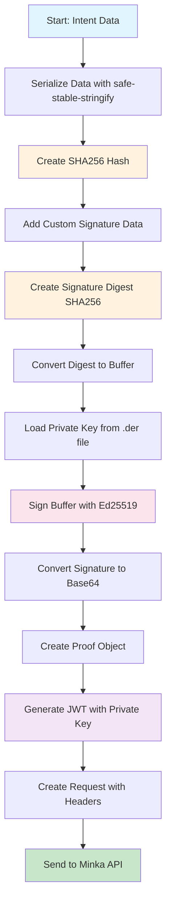

# Minka Authentication Flow

## Overview

The Minka API authentication process follows a secure, multi-step flow that ensures data integrity and authenticates requests through cryptographic signatures and JWT tokens.

## Authentication Flow Diagram

### Visual Flow (Mermaid)



### ASCII Flow (GitBook Compatible)

```
┌─────────────────┐
│   Intent Data   │
└─────────┬───────┘
          │
          ▼
┌─────────────────┐
│ Serialize Data  │
│ (safe-stable-   │
│  stringify)     │
└─────────┬───────┘
          │
          ▼
┌─────────────────┐
│ Create SHA256   │
│ Hash            │
└─────────┬───────┘
          │
          ▼
┌─────────────────┐
│ Add Custom      │
│ Signature Data  │
└─────────┬───────┘
          │
          ▼
┌─────────────────┐
│ Create Signature│
│ Digest SHA256   │
└─────────┬───────┘
          │
          ▼
┌─────────────────┐
│ Convert to      │
│ Buffer          │
└─────────┬───────┘
          │
          ▼
┌─────────────────┐
│ Load Private    │
│ Key (.der file) │
└─────────┬───────┘
          │
          ▼
┌─────────────────┐
│ Sign with       │
│ Ed25519         │
└─────────┬───────┘
          │
          ▼
┌─────────────────┐
│ Convert to      │
│ Base64          │
└─────────┬───────┘
          │
          ▼
┌─────────────────┐
│ Create Proof    │
│ Object          │
└─────────┬───────┘
          │
          ▼
┌─────────────────┐
│ Generate JWT    │
│ with Private Key│
└─────────┬───────┘
          │
          ▼
┌─────────────────┐
│ Create Request  │
│ with Headers    │
└─────────┬───────┘
          │
          ▼
┌─────────────────┐
│ Send to Minka   │
│ API             │
└─────────────────┘
```

## Step-by-Step Security Process

### Phase 1: Data Preparation

1. **Data Serialization** - Convert intent data to consistent string format
2. **Hash Generation** - Create SHA256 hash of serialized data
3. **Custom Data Addition** - Add timestamp and status information
4. **Signature Digest** - Create second SHA256 hash combining data hash + custom data

### Phase 2: Cryptographic Signing

5. **Buffer Conversion** - Convert hex digest to binary buffer
6. **Private Key Loading** - Load Ed25519 private key from .der file
7. **Digital Signing** - Sign buffer using Ed25519 algorithm
8. **Base64 Encoding** - Convert signature to Base64 string

### Phase 3: Authentication Token

9. **Proof Object Creation** - Combine all signature components
10. **JWT Generation** - Create JWT token with private key
11. **Request Assembly** - Build complete API request with headers
12. **API Transmission** - Send authenticated request to Minka API

## Security Components

### Data Integrity

- **SHA256 Hashing** ensures data hasn't been tampered with
- **Deterministic Serialization** guarantees consistent hashing
- **Custom Signature Data** adds additional security context

### Cryptographic Security

- **Ed25519 Digital Signatures** provide strong authentication
- **Private Key Protection** via .der file format
- **Base64 Encoding** ensures safe transmission

### Token-Based Authentication

- **JWT Tokens** provide stateless authentication
- **Time-based Expiration** limits token validity
- **Bearer Token Authorization** in HTTP headers

## Key Security Features

| Feature              | Purpose                      | Implementation                     |
| -------------------- | ---------------------------- | ---------------------------------- |
| **Data Hashing**     | Integrity verification       | SHA256 of serialized data          |
| **Signature Digest** | Additional security layer    | SHA256 of hash + custom data       |
| **Ed25519 Signing**  | Cryptographic authentication | Digital signature with private key |
| **JWT Tokens**       | Stateless authentication     | Signed token with expiration       |
| **Custom Data**      | Context and timing           | Timestamp and status information   |

## Security Benefits

### 1. **Data Integrity**

- Any modification to the data will result in a different hash
- Signature verification will fail if data is tampered with
- Custom signature data adds additional validation context

### 2. **Authentication**

- Private key proves the request comes from authorized source
- Ed25519 provides strong cryptographic security
- JWT tokens enable stateless authentication

### 3. **Non-Repudiation**

- Digital signatures cannot be forged without private key
- Each request is uniquely signed and verifiable
- Audit trail through signature verification

### 4. **Time-based Security**

- JWT tokens have expiration times
- Custom signature data includes timestamps
- Prevents replay attacks through time validation

## Implementation Security Checklist

- [ ] **Private Key Security** - Store .der file securely, never in code
- [ ] **Environment Variables** - Use env vars for sensitive configuration
- [ ] **HTTPS Only** - Always use encrypted connections
- [ ] **Key Rotation** - Regularly rotate private keys
- [ ] **Input Validation** - Validate all data before processing
- [ ] **Error Handling** - Don't expose sensitive information in errors
- [ ] **Logging** - Log security events without exposing keys
- [ ] **Testing** - Test authentication with invalid/expired tokens

## Common Security Pitfalls

### ❌ **Avoid These Practices**

- Hardcoding private keys in source code
- Using HTTP instead of HTTPS
- Exposing private keys in error messages
- Not validating input data
- Using weak or compromised keys
- Not implementing proper error handling

### ✅ **Best Practices**

- Use environment variables for configuration
- Implement proper key management
- Validate all input data
- Use secure communication channels
- Implement proper logging and monitoring
- Regular security audits and key rotation

## Flow Summary

The Minka authentication flow provides multiple layers of security:

1. **Data Layer** - Ensures data integrity through hashing
2. **Signature Layer** - Provides authentication through digital signatures
3. **Token Layer** - Enables stateless authentication with JWT
4. **Transport Layer** - Secures communication with HTTPS

This multi-layered approach ensures that only authorized parties can make valid requests to the Minka API while maintaining data integrity and providing strong authentication guarantees.
